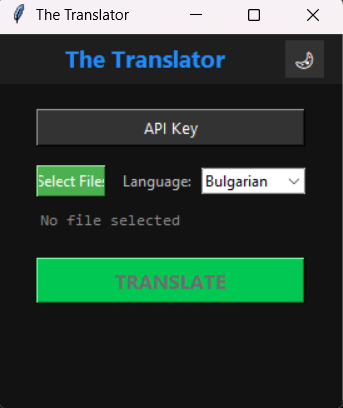
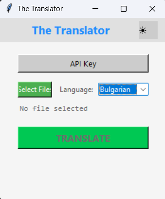
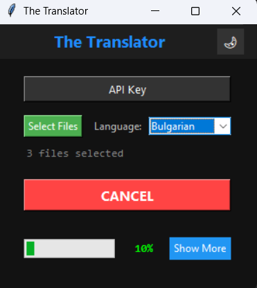
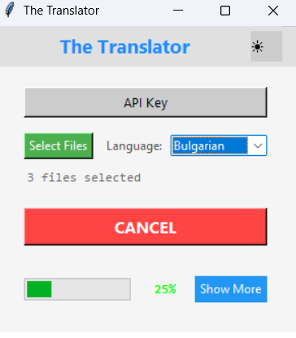
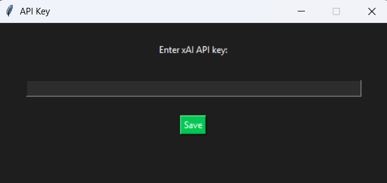
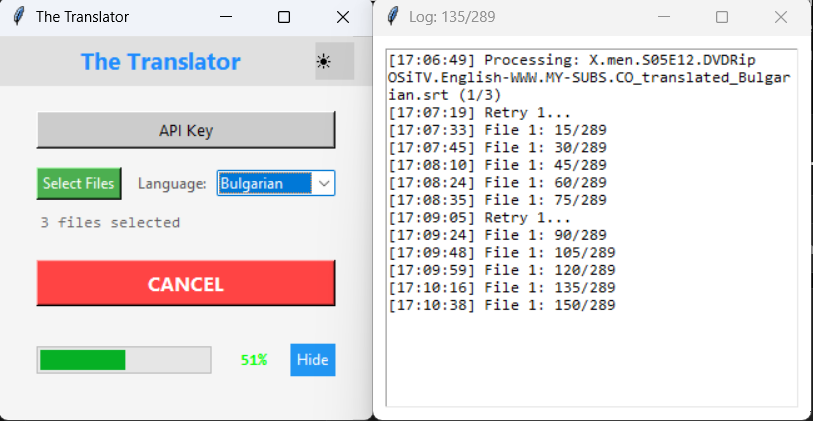
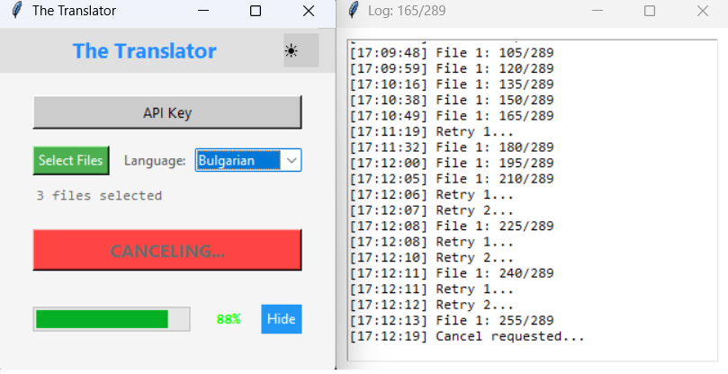

# The Translator

Simple yet powerful desktop tool for translating **.srt** subtitles and **.json** localization files using **xAI Grok-3**.

[](https://www.python.org)
[](LICENSE)

## Screenshots

### Dark & Light Theme (idle)
| Dark Theme                                      | Light Theme                                       |
|-------------------------------------------------|---------------------------------------------------|
|  |  |

### Translation in progress
| Dark Theme (translating)                        | Light Theme (translating)                         |
|-------------------------------------------------|---------------------------------------------------|
|    |  |

### Key features in action
| API Key input                                  | Live docked log (with retry)                     | Cancel → partial save                          |
|------------------------------------------------|--------------------------------------------------|------------------------------------------------|
|           |      |  |

> Instant dark/light mode • Live log attached to the right • Automatic retries • Cancel anytime with partial file saved automatically

## Features
- Modern dark/light GUI (Tkinter)
- Translate multiple files at once
- Cancel anytime → partial result is **always saved**
- Live docked log window (moves with the main window)
- 2 automatic retries + fallback to original text
- Preserves JSON formatting, comments and structure
- One-click .exe build (Windows)

## Requirements
- Python 3.8+
- xAI API key → https://x.ai/api

## How to run

```bash
# 1. Clone & enter folder
git clone https://github.com/CvetelinStoimenov/the_translator.git
cd TheTranslator

# 2. Create a virtual environment (recommended)
python -m venv venv

# 3. Activate it
# Windows:
venv\Scripts\activate
# Linux/macOS:
source venv/bin/activate

# 4. Install dependencies
pip install -r requirements.txt

# 5. Run!
python translator.py
```
Your xAI API key can be placed in api_key.txt or entered via the GUI.
Build Windows executable (.exe)
Easiest way
Double-click build_exe.bat → done!
Your TheTranslator.exe will be in the dist\ folder.
Or manually:

```bash
bashpyinstaller --onefile --windowed --name "TheTranslator" translator.py
```
License
MIT License © 2025 Cvetelin Stoimenov
